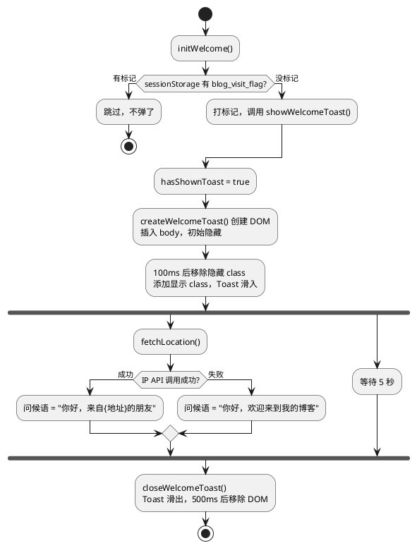

# Firefly 主题 WelcomeToast 组件分析

Firefly是一个基于 Astro的博客主题。

::github{repo="CuteLeaf/Firefly"}

WelcomeToast 是我自己加的一个小组件，效果就是访客第一次打开页面时，右下角会弹出一个欢迎卡片，还带了 IP 地理位置的个性化问候，5 秒后自动消失。


---

## 涉及的文件

整个组件涉及两个文件：

| 文件 | 路径 |
|------|------|
| 组件本身 | `src/components/WelcomeToast.astro` |
| 在布局中引用 | `src/layouts/MainGridLayout.astro` |

---

## 组件是怎么实现的

这个组件的 frontmatter 是空的，没有任何服务端逻辑。所有事情都在浏览器端的 `<script>` 和 `<style>` 里完成。

### 页面上长什么样

组件本身不输出任何 HTML，所有 DOM 都是 JS 动态生成的。结构大概是这样：

```
#welcome-toast（固定在右下角，z-50）
└── 一个卡片 div（白色背景、圆角、阴影）
    ├── 👋 表情
    ├── 文字区
    │   ├── 问候语（一开始显示"正在加载..."，后面会变成具体地址）
    │   └── 副标题"欢迎来到我的博客"
    └── 关闭按钮（一个 ×）
```

### 几个关键函数

整个逻辑不复杂，就是 5 个函数各管各的事：

```typescript
// 用 sessionStorage 做会话标识，防止重复弹出
const VISIT_SESSION_KEY = 'blog_visit_flag';
let hasShownToast = false;

// 创建 Toast 的 DOM 结构，插入到页面上
function createWelcomeToast()

// 关掉 Toast：先滑出去，500ms 后把节点从 DOM 里移掉
function closeWelcomeToast()

// 请求一个免费的 IP API，拿到访客的位置信息
async function fetchLocation()

// 整个弹出流程的"导演"：创建 → 滑入 → 拿位置 → 5秒后自动关闭
async function showWelcomeToast()

// 入口函数：判断是不是第一次访问，是的话才弹
function initWelcome()
```

### 执行顺序

说白了就是这么个流程：



### 怎么适配 SPA 导航的

这里有个坑：Firefly 用了 Swup 做客户端路由，页面切换的时候不会走完整的 `DOMContentLoaded`。所以组件同时绑了两个事件：

```typescript
if (document.readyState === 'loading') {
    document.addEventListener('DOMContentLoaded', initWelcome);
    document.addEventListener('astro:page-load', initWelcome);  // Swup 专用
} else {
    initWelcome();
}
```

另外关闭按钮用的是内联 `onclick`，所以函数得挂到 `window` 上才能调用：

```typescript
(window as any).closeWelcomeToast = closeWelcomeToast;
```

### 样式部分

- **桌面端**：固定在右下角（`fixed bottom-4 right-4 z-50`），用 CSS transition 做滑入滑出动画，500ms ease-out。
- **移动端**（640px 以下）：改到屏幕底部居中，宽度 90%，不会遮挡太多内容。
- **深色模式**：用 Tailwind 的 `dark:` 变体自动切换背景色、边框色和文字色。

---

## 在 MainGridLayout 里怎么放的

MainGridLayout 是 Firefly 的主布局，导航栏、壁纸、侧边栏、Footer 都在这里面。WelcomeToast 在第 7 行被 import，然后放在了第 858 行：

```typescript
import WelcomeToast from "@components/WelcomeToast.astro";
```

具体位置是在 `#swup-container` 里面、`<slot />` 后面：

```astro
<main id="swup-container" class="transition-main">
    <div id="content-wrapper">
        <slot></slot>
    </div>
    <WelcomeToast />
</main>
```

整个布局大概是这么个层级关系：

```
Layout.astro
└── MainGridLayout.astro
    ├── Navbar（导航栏）
    ├── Wallpaper（背景壁纸）
    ├── <main id="swup-container">      ← Swup 的容器，导航时会替换这里面的内容
    │   ├── <slot>                       ← 每个页面的具体内容
    │   └── <WelcomeToast />             ← 放在内容后面
    ├── Footer（页脚）
    └── FloatingControls（浮动控制按钮）
```

### 几个值得注意的点

- **没传任何 props**：组件完全是自包含的，不需要从外面传参数。
- **靠 sessionStorage 去重**：每次 Swup 导航都会重建组件，但因为有 `blog_visit_flag` 标记，所以不会重复弹出。
- **兼容 Swup 的 astro:page-load 事件**：客户端路由切换后也能正常触发。
- **构建时没有 HTML 输出**：组件只有 `<script>` 和 `<style>`，不产生静态 HTML，全靠 JS 在浏览器里创建。

---

## 总结

WelcomeToast 说白了就是一个浏览器端的欢迎弹窗，用 `sessionStorage` 保证每个会话只弹一次，用 IP API 拿位置做个性化问候，5 秒自动消失。放在 Firefly 主题的 MainGridLayout 里，和 Swup 的 SPA 导航机制配合得很好。