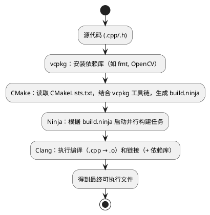

## 介绍

Linux 做 C++ 开发确实舒服，工具链齐全，编译速度也快。这篇文章手把手教你在 Debian 系的 Linux 上，用 VS Code + Clang + CMake + Ninja + vcpkg 搭一套现代化的开发环境，最后还会用 C++20 模块跑一个示例项目。

### 需要装的东西

1. **编译器**：Clang
2. **项目构建器**：CMake
3. **本地构建器**：Ninja
4. **依赖包管理**：vcpkg



## 安装和配置

### 1. 安装 Clang 编译器

Clang 的错误提示比 GCC 友好很多，而且对新标准的支持一直很积极。截至 2026 年 4 月，最新稳定版是 Clang 22.1.3。Clang 23 已经有预发布版了，但建议还是用稳定的。

用 LLVM 官方脚本装最省事：

```bash
wget https://apt.llvm.org/llvm.sh
chmod +x llvm.sh
sudo ./llvm.sh 22
```

脚本跑完会自动添加 LLVM 的 APT 仓库，然后装好 clang-22 和相关工具。

装完之后设一下默认版本，这样终端里直接输 `clang` 就能用：

```bash
sudo update-alternatives --install /usr/bin/clang clang /usr/bin/clang-22 100
sudo update-alternatives --install /usr/bin/clang++ clang++ /usr/bin/clang++-22 100
sudo update-alternatives --install /usr/bin/clangd clangd /usr/bin/clangd-22 100
sudo update-alternatives --install /usr/bin/lldb lldb /usr/bin/lldb-22 100
sudo update-alternatives --install /usr/bin/lld lld /usr/bin/lld-22 100
sudo update-alternatives --install /usr/bin/clang-tidy clang-tidy /usr/bin/clang-tidy-22 100
sudo update-alternatives --install /usr/bin/clang-format clang-format /usr/bin/clang-format-22 100
```

跑完 `clang --version` 看一下，输出里有 "clang version 22.1.3" 就说明装好了。

### 2. 安装 CMake 构建系统

CMake 是 C++ 项目构建的标配，能生成各种构建系统需要的文件。当前最新稳定版是 CMake 4.3.1。

从官方下载安装脚本：

```bash
wget https://github.com/Kitware/CMake/releases/download/v4.3.1/cmake-4.3.1-linux-x86_64.sh
```

```bash
chmod +x cmake-4.3.1-linux-x86_64.sh
sudo ./cmake-4.3.1-linux-x86_64.sh --prefix=/opt/cmake-4.3.1 --skip-license
```

然后配一下默认版本：

```bash
sudo update-alternatives --install /usr/bin/cmake cmake /opt/cmake-4.3.1/bin/cmake 100
sudo update-alternatives --install /usr/bin/ctest ctest /opt/cmake-4.3.1/bin/ctest 100
sudo update-alternatives --install /usr/bin/cpack cpack /opt/cmake-4.3.1/bin/cpack 100
```

`cmake --version` 能看到 4.3.1 就 OK 了。

### 3. 安装 Ninja 构建工具

Ninja 专注速度，配合 CMake 用编译特别快。目前最新稳定版是 1.13.2。

从 GitHub 下载预编译的二进制文件，解压放到系统路径里就行：

```bash
wget https://github.com/ninja-build/ninja/releases/download/v1.13.2/ninja-linux.zip
unzip ninja-linux.zip
sudo mv ninja /usr/bin/ninja
sudo chmod +x /usr/bin/ninja
ninja --version
```

### 4. 安装 vcpkg 包管理器

vcpkg 是微软出的 C++ 库管理器，装第三方库特别方便，不用手动折腾依赖。最新稳定版是 2026.04.08。

```bash
cd ~
git clone https://github.com/microsoft/vcpkg.git
cd vcpkg
# Linux 下用 .sh 结尾的引导脚本
./bootstrap-vcpkg.sh
```

装好后把路径加到环境变量里，编辑 `~/.bashrc` 或 `~/.zshrc`：

```bash
export PATH=/opt/cmake-4.3.1/bin:$PATH
export VCPKG_ROOT=~/vcpkg
export PATH=$VCPKG_ROOT:$PATH
```

改完重启终端或者 `source ~/.bashrc`，然后 `vcpkg --version` 看看版本就对了。

### 5. Visual Studio Code

VS Code 做 C++ 开发挺好用的（当然你也可以用 CLion 之类的）。装好之后去扩展市场搜这几个插件：

1. **Clangd**（作者: LLVM）：代码补全、跳转、实时诊断，比微软的 C/C++ 插件好用。
2. **CodeLLDB**（作者: Vadim Chugunov）：本地调试器，跟 VS Code 集成得很好。
3. **CMake Tools**（作者: Microsoft）：直接在 VS Code 里配置、构建、运行 CMake 项目。
4. **CMake**（作者: Microsoft）：给 CMakeLists.txt 提供语法高亮。

## 构建和运行你的第一个程序

用 C++20 的模块特性来写第一个项目。

### 项目结构

建一个项目文件夹，结构长这样：

```
CppProject/
├── .vscode/
│   └── launch.json      # 调试配置（后面会创建）
├── CMakeLists.txt       # CMake 项目配置
├── CMakePresets.json    # CMake 预设
├── main.cpp             # 主程序
├── utilities.ixx        # 一个简单的 C++20 模块
└── vcpkg.json           # vcpkg 依赖描述
```

不知道这些文件里写什么的话，把这篇文章丢给 AI 让它帮你生成。

### 配置代码和调试器

`utilities.ixx` 模块文件：

```cpp
module;
#include <string>
export module utilities;
export auto get_greeting() {
    return "Hello from a C++20 Module!";
}
```

主程序 `main.cpp`：

```cpp
import utilities;
#include <fmt/core.h>
int main() {
    fmt::print("{}\n", get_greeting());
    return 0;
}
```

调试配置文件 `.vscode/launch.json`，注意 `program` 的路径要跟你的构建输出目录对上：

```json
{
    "version": "0.2.0",
    "configurations": [
        {
            "type": "lldb",
            "request": "launch",
            "name": "Debug (LLDB)",
            "program": "${workspaceFolder}/build/linux_clang/Debug/Rocket",
            "args": [],
            "cwd": "${workspaceFolder}"
        }
    ]
}
```

### 配置、构建与运行

#### 1. 选择预设

在 VS Code 里打开项目文件夹，`Ctrl+Shift+P` 打开命令面板，输入 `CMake: Select Configure Preset`，根据你的系统和编译器选一个合适的预设。

#### 2. 开始构建

再打开命令面板，输入 `CMake: Build`，或者直接按 `F7`。CMake 会调用 Clang 和 Ninja 来编译和链接。

#### 3. 运行与调试

构建成功后，点 VS Code 底部的 ▶️ 按钮就能运行。设好断点按 `F5` 启动调试，`F10` 单步执行，变量值也能实时看到。

## 总结

搞定了，你现在有了一套完整的现代化 C++ 开发环境。不管是自己学习还是团队协作都能用。

有两个要注意的地方：

1. 装完所有工具后，记得用 `--version` 一个个验证版本，确保环境变量没配错。
2. `launch.json` 是项目的调试启动配置，新建项目的时候记得把这个文件复制过去，然后把 `program` 字段改成新项目的可执行文件路径。
3. `CMakeLists.txt` 和 `CMakePresets.json` 不知道怎么写的话，直接问 AI 就行。
